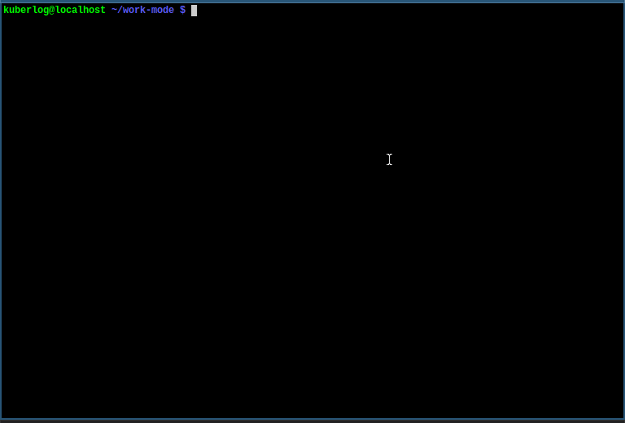

### work-mode

Keep your work and personal files seperate on the same machine without seperate user

## About the Project

If you want to use the same computer and user for both personal and work purposes, then th
bout your browser history, `Downloads` folder, or private files being exposed when on a Zo

## How to use

Copy `work-mode.json` to `~/.work-mode.json` or `~/.config/work-mode.json`

Replace default directories in the config file with directories you want to have images for

`work-mode on` when you start work

`work-mode off` when you are finished

### Built with

* `mkfs`
* `fallocate`
* `mount`

### How it works

`work-mode` mounts `.img` files on top of existing personal directories, effectively shadowing their contents.

For example, if `Downloads` is in your `.work-mode-dirs`, then a coresponding .img file will be mounted at `Downloads` when `work-mode on` is called, effectively hiding all of your personal downloads. Then when `work-mode off` is called, the img will be unmounted, revealing the personal contents again.

Reccomended folers to shadow:
* `.config/Firefox` to have seperate broswer histories
* `Downloads/` so coworkers won't see all the random things you are downloading
* `pics/` to hide your selfies

### Why not multiple users?

As a developer, there is a lot of configuration and software that should be shared between a work and personal computing environment. Keeping seperate users and user directories for the two environments will lead to duplication of that configuration.

